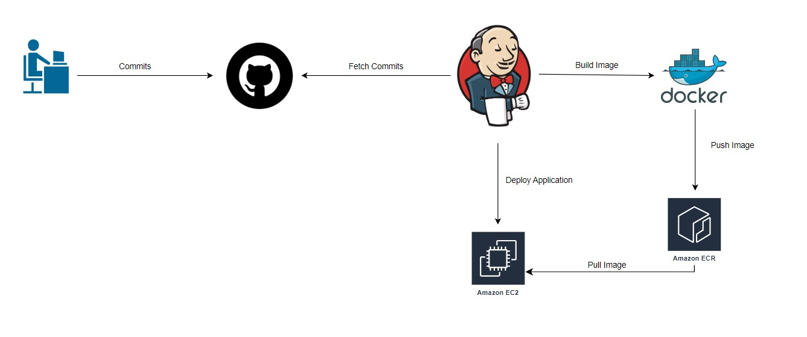

# SAMPLE JENKINS PIPELINE WITH GITHUB, DOCKER AND SSH

## Started

1. Create aws resources

```bash
# create terraform.tfvars contains aws access key and secret key information
$ cd terraform
$ terraform init
$ terraform plan
$ terraform apply --auto-approve
```

2. Add Jenkins credentials

- Create registry_credentials type "Username with Password"
- Create git_credentials type "Username with Password"
- Create backend-ssh-server type "SSH Username with private key"

3. Create Jenkins pipeline and start pipeline

## Technology

- Jenkins
- Docker
- Terraform

## Architecture for sample project


